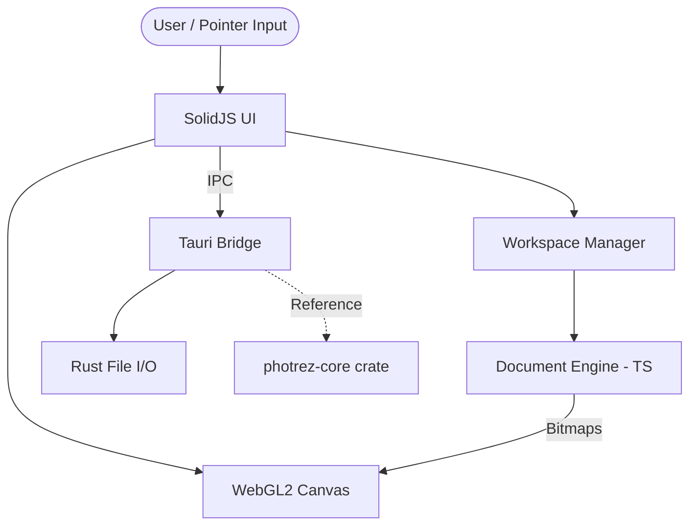

<p align="center">
  
</p>

<h1 align="center">
  <strong>Photrez</strong>
</h1>

<p align="center">
  A fast, lightweight desktop image editor for everyday image work.
  Layers, selection, transform, crop, brush &amp; eraser, and print-ready export —
  built for content creators and small business owners who want a no-nonsense editor
  that opens instantly and stays out of the way.
</p>

<p align="center">
  <a href="https://github.com/photrez/photrez/actions/workflows/ci.yml"></a>
  <a href="https://github.com/photrez/photrez/releases"></a>
  <a href="https://github.com/photrez/photrez/blob/main/LICENSE"></a>
  <a href="https://github.com/photrez/photrez/stargazers"></a>
  <a href="https://github.com/photrez/photrez/issues"></a>
  
</p>


Photrez is an open-source desktop image editor with a compact, familiar workflow: layers, selection, transform, crop, brush, eraser, history, print settings, and a WebGL2 canvas. It is built with Tauri, SolidJS, TypeScript, and Rust (for core compute).

Photrez `v0.1.0` is the first stable release of the MVP: the complete editing toolkit, layered document model, and the locked `.ptz` project format (backward-compatible from here on). Windows 10/11 is the supported platform; macOS/Linux builds are planned.

- **Supported platform:** Windows 10/11 (macOS/Linux builds planned)
- **Known issues:** See [KNOWN_ISSUES.md](KNOWN_ISSUES.md)
- **Bug reports:** [GitHub Issues](https://github.com/photrez/photrez/issues)
- **Security:** See [SECURITY.md](SECURITY.md)

## Contents

- [Install](#install)
- [Quick Start (for Developers)](#quick-start-for-developers)
- [Features](#features)
- [Why Photrez](#why-photrez)
- [Tech Stack](#tech-stack)
- [Runtime Architecture](#runtime-architecture)
- [Repository Layout](#repository-layout)
- [Documentation](#documentation)
- [Roadmap](#roadmap)
- [FAQ](#faq)
- [Contributing](#contributing)

## Install

> **Note:** The Windows installer is not code-signed yet — SmartScreen may show an unverified-publisher warning (see step 3).

**Windows 10/11:**

1. Download [Photrez_0.1.0_x64-setup.exe](https://github.com/photrez/photrez/releases/download/v0.1.0/Photrez_0.1.0_x64-setup.exe) from the [latest release](https://github.com/photrez/photrez/releases).
2. Run the installer and follow the steps.
3. If SmartScreen shows an unverified-publisher warning, click **More info** then **Run anyway** — the installer is not code-signed yet.

All releases: https://github.com/photrez/photrez/releases

## Quick Start (for Developers)

### Requirements

- **Bun 1.3.14** (from [bun.com](https://bun.com)) — the repo pins it via `packageManager`, so `bun install` uses the matching version
- **Rust** stable toolchain (via [rustup](https://rustup.rs))
- **Tauri 2 prerequisites** for your OS: <https://v2.tauri.app/start/prerequisites/>
- **System WebView** (Windows: WebView2; macOS: Cocoa; Linux: webkit2gtk) — required by the Tauri shell

### Install, run, build, verify

```bash
bun install          # install dependencies
bun run tauri dev    # run the desktop app
bun run build        # build the frontend
bun run verify       # full check (tests + build + audit + perf budget)
```

Focused checks:

```bash
bun run --filter photrez-desktop test --run
bun run build
cargo test -p photrez-core
cargo test --workspace
```

## Features

| Area | Status |
| --- | --- |
| Desktop shell | Custom title bar, menus, dialogs, native window actions, file open/export |
| Workspace | Multi-document tabs, drag and drop, cross-document layer movement |
| Layers | Add, duplicate, delete, reorder, opacity, visibility, lock, merge down, flatten |
| Selection | Rectangle + elliptical marquee, inverted selection, cut/copy/paste/delete |
| Transform | Move, scale, rotate, flip, snapping, keyboard nudges |
| Crop and resize | Classic and modern crop modes, canvas expansion, resize dialog |
| Paint | Brush and eraser with calibrated round-tip hardness, flow, smoothing, presets; gradient and fill tools |
| Print | Pro-Suite print settings: paper preview, scale/position/PPI inspector, paper presets, unit converter, high-DPI print spooling |
| Export | PNG, JPEG, and WebP |
| Testing | Frontend, Rust, browser, export, dialog, pointer-chain, and paint regression coverage |

## Why Photrez

- **Lightweight desktop feel:** a Tauri shell, compact editor chrome, and a tool-first workflow.
- **Practical editing core:** layers, transforms, crop, brush, eraser, color, export, and history.
- **Fast feedback loop:** focused unit, component, pointer-chain, browser, and Rust tests.
- **Clear boundaries:** SolidJS owns the UI, TypeScript owns the current MVP document engine, WebGL2 owns active rendering, and the Rust crates track core domain work.

## Tech Stack

- **Desktop:** Tauri 2
- **Frontend:** SolidJS, TypeScript, Vite
- **Styling:** Tailwind CSS v4
- **Renderer:** WebGL2 for the current MVP runtime
- **Core:** TypeScript `DocumentEngine` for the current editor hot path
- **Rust (future):** `photrez-core` domain crate (WASM compile target)

## Runtime Architecture

Here is how the pieces talk to each other at runtime:



## Repository Layout

```text
apps/desktop/       Tauri desktop app and SolidJS editor UI
crates/core/        Rust core domain model and tests (WASM compile target)
docs/spec/          Product and technical specifications
docs/reference/     Runtime contracts, shortcuts, file formats, and inventories
docs/ARCHITECTURE.md
docs/FEATURES.md
docs/DESIGN.md      Visual design system
docs/PRODUCT.md     Product context
```

## Documentation

- [Known Issues](KNOWN_ISSUES.md)
- [Architecture](docs/ARCHITECTURE.md)
- [Feature Status](docs/FEATURES.md)
- [Product Scope](docs/spec/product-scope.md)
- [Product Requirements](docs/spec/prd.md)
- [Technical Requirements](docs/spec/trd.md)
- [Command Contract](docs/reference/command-contract-spec.md)
- [Keyboard Shortcuts](docs/reference/keyboard-shortcut-map.md)
- [File Format Support](docs/reference/file-format-support.md)
- [Design System](docs/DESIGN.md)
- [Contributing](CONTRIBUTING.md)
- [Security Policy](SECURITY.md)

## Roadmap

- **Released: `0.1.0`** (2026-08-06) — first stable release: complete MVP toolkit, `.ptz` v1 backward compatibility guaranteed from here, Windows x64 installer.
- **Next: `0.2.0`** — text & shapes layers plus full blend modes.
- **`0.3.0`** — floating panels. **`0.4.0`** — multi-image windows + WASM extension.

See [roadmap.md](docs/spec/roadmap.md) for the full plan.

## FAQ

**Is Photrez production-ready?**

Yes. `v0.1.0` is the first stable release on Windows. The MVP feature set works end-to-end; known limitations are tracked in [KNOWN_ISSUES.md](KNOWN_ISSUES.md).

**Why Windows-only?**

The MVP targets Windows 10/11 to keep scope tight. macOS/Linux builds are planned.

**Does Photrez support PSD files?**

Not yet. `.ptz` (Photrez project format) and common image formats are supported today; PSD is on the longer-term roadmap.

**Can I contribute?**

Yes. See [Contributing](#contributing) and [CONTRIBUTING.md](CONTRIBUTING.md).

## Contributing

Photrez welcomes careful, scoped contributions. Good first contributions include documentation cleanup, reproducible bug reports, focused tests, accessibility fixes, and small UI polish that preserves the existing editor layout.

Please read [CONTRIBUTING.md](CONTRIBUTING.md) before opening a pull request.

## Security

Please report security issues privately before public disclosure. See [SECURITY.md](SECURITY.md).

## License

Photrez is licensed under AGPL-3.0-or-later. See [LICENSE](LICENSE) and [NOTICE](NOTICE).
